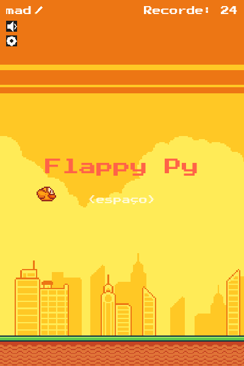
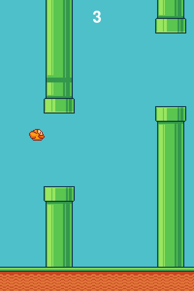
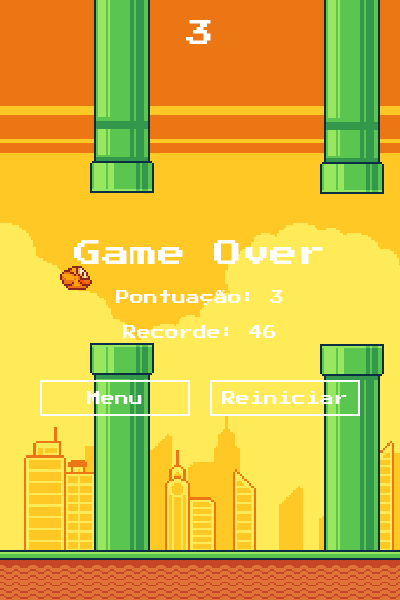
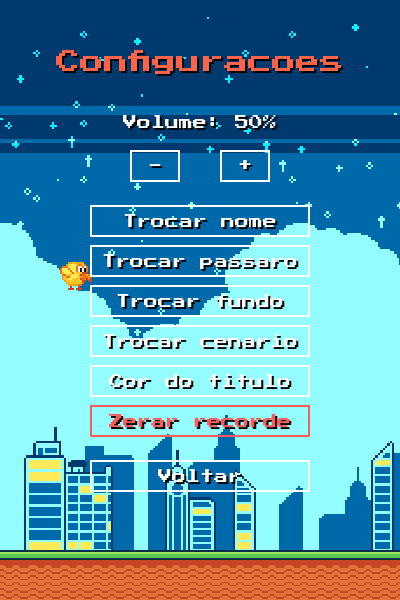

# Flappy Py


Um clone do clássico *Flappy Bird* feito em Python com [Pygame](https://www.pygame.org/), construído do zero como projeto de estudo de arquitetura de software aplicada a jogos.

<p align="center">
  
  
  
  
</p>

## Sobre o projeto

Este projeto não teve como objetivo só "fazer o jogo funcionar", mas praticar arquitetura de software: separação de responsabilidades, encapsulamento e código legível, evitando complexidade desnecessária a cada etapa. Cada funcionalidade foi construída incrementalmente — física do pássaro, colisão, canos, pontuação, estados de jogo (menu/jogando/game over) e, por fim, arte de verdade no lugar de formas geométricas.

## Funcionalidades

- Física de queda livre e pulo do pássaro (gravidade + impulso), calibrada pra uma sensação de jogo suave
- Geração procedural de canos em intervalos regulares, com abertura em posição aleatória
- Dificuldade progressiva: canos (e chão) ficam mais rápidos a cada 5 pontos, até um teto
- Detecção de colisão (pássaro × chão, pássaro × canos)
- Pontuação com recorde persistente **por jogador** entre execuções
- Máquina de estados: **nome do jogador → menu → jogando → game over → reiniciar/configurações**
- Pássaro com animação de bater asas (sprite sheet) — inclusive uma animação de flutuação ociosa na tela de menu
- Canos, chão e fundo (parallax scrolling) com sprites reais, fonte pixelada (Press Start 2P) e efeitos sonoros
- Identificação do jogador: nome digitado na primeira execução, editável a qualquer momento (clique no nome ou pela tela de configurações)
- Personalização: cor do título alternável por clique, com dica visual pulsante
- Tela de configurações: volume (com botão de mutar rápido no menu), trocar nome, cor do título, zerar recorde
- Navegação por botões (não só teclado) nas telas de menu e game over

## Arquitetura

O projeto segue separação de responsabilidades: cada módulo cuida de uma única coisa, e o `Game` apenas orquestra — sem conhecer os detalhes internos de cada entidade.

| Módulo | Responsabilidade |
|---|---|
| `main.py` | Ponto de entrada — cria e roda o `Game` |
| `game.py` | Orquestra o loop principal, os estados do jogo e a interação entre entidades |
| `constantes.py` | Toda a configuração do jogo (tamanhos, velocidades, cores, caminhos de assets) num só lugar |
| `bird.py` | Física, animação e desenho do pássaro |
| `background.py` | Rolagem contínua (parallax) do céu |
| `pipe.py` | Geração, movimento, desenho e detecção de "ultrapassado" de cada par de canos |
| `ground.py` | Posição, rolagem (tiled) e desenho do chão, na mesma velocidade dos canos |
| `collision.py` | Função genérica de colisão entre retângulos, reaproveitada para chão e canos |
| `audio.py` | Carregamento, volume e reprodução dos efeitos sonoros |
| `score.py` | Contagem/exibição da pontuação e persistência do recorde por jogador (JSON) |
| `jogador.py` | Nome do jogador: estado sendo digitado e persistência em disco |
| `menu.py` | Telas de menu (nome, inicial, game over), botões reutilizáveis e ícones desenhados (lápis, mudo, engrenagem) |
| `configuracoes.py` | Tela de configurações (volume, trocar nome, cor do título, zerar recorde) |

**Decisões de design que valem destacar:**
- Cada entidade encapsula o próprio estado e comportamento (`Bird.pousar()`, `Cano.foi_ultrapassado()`) — o `Game` nunca lê ou altera atributos internos diretamente, só chama métodos.
- `collision.colidiu()` é uma função pura e genérica (dois retângulos → booleano), reaproveitada sem alteração tanto para o chão quanto para os canos.
- Sprites são carregados uma única vez (cache em atributo de classe) e recortados de sprite sheets via `Surface.subsurface()`, em vez de um arquivo de imagem por elemento.
- Estados do jogo (`ESTADO_MENU`, `ESTADO_JOGANDO`, `ESTADO_GAME_OVER`, etc.) são simples constantes de string, não um padrão *State* completo — decisão deliberada para manter a complexidade proporcional ao tamanho do projeto.
- A fonte pixelada não tem glifos de emoji, então os ícones (lápis, alto-falante, engrenagem) são desenhados com `pygame.draw` (polígonos simples) em vez de caracteres de fonte.
- Telas que podem levar à edição do nome (menu e configurações) guardam de onde vieram (`origem_estado_nome`) pra saber pra onde voltar ao confirmar — evita hardcode de navegação.

## Tecnologias

- [Python 3.13](https://www.python.org/)
- [Pygame 2.6.1](https://www.pygame.org/)

## Como executar

```bash
# 1. Crie e ative um ambiente virtual
python -m venv .venv
.venv\Scripts\activate      # Windows
# source .venv/bin/activate  # Linux/macOS

# 2. Instale as dependências
pip install -r requirements.txt

# 3. Rode o jogo
python src/main.py
```

**Controles:** barra de espaço para pular / começar / reiniciar; mouse para os botões, ícones e cor do título.

## Estrutura de pastas

```
flappypy/
├── assets/
│   ├── images/       # sprites (pássaro, canos, tiles, backgrounds)
│   ├── sounds/        # efeitos sonoros
│   └── fonts/          # fonte pixelada (Press Start 2P)
├── data/               # recorde e nome do jogador salvos em disco (gerado em runtime, fora do controle de versão)
├── docs/               # screenshots usados neste README
├── src/                # código-fonte
└── requirements.txt
```

## Roadmap

- [x] Fundo com parallax scrolling
- [x] Efeitos sonoros (pulo, colisão, ponto)
- [x] Recorde persistente entre execuções
- [x] Ajuste fino de física (gravidade/impulso) para uma sensação de jogo mais suave
- [x] Identificação do jogador (nome editável) e tela de configurações (volume, cor do título, zerar recorde)
- [x] Chão com parallax scrolling (mesma velocidade dos canos)
- [x] Dificuldade progressiva (canos e chão aceleram a cada 5 pontos)
- [x] Recorde por jogador (cada nome tem seu próprio recorde salvo)

Todos os itens planejados foram concluídos.

## Créditos

Os sprites (pássaro, canos e tiles de chão) são do pacote [Flappy Bird Assets](https://megacrash.itch.io/flappy-bird-assets), por **megacrash** (itch.io). Direitos de uso sujeitos aos termos da página original — consulte antes de reutilizar este repositório para outros fins.

Os efeitos sonoros (pulo, ponto e game over) vieram do [Pixabay](https://pixabay.com), sob a licença da própria plataforma.

A fonte usada na interface é [Press Start 2P](https://fonts.google.com/specimen/Press+Start+2P), do Google Fonts, licenciada sob a [SIL Open Font License](assets/fonts/OFL.txt).

## Licença

Distribuído sob a licença MIT. Veja [LICENSE](LICENSE) para mais detalhes. A licença cobre o código-fonte deste repositório; os assets de terceiros seguem sua própria licença (veja Créditos acima).

## Autor

**itsmariah**
